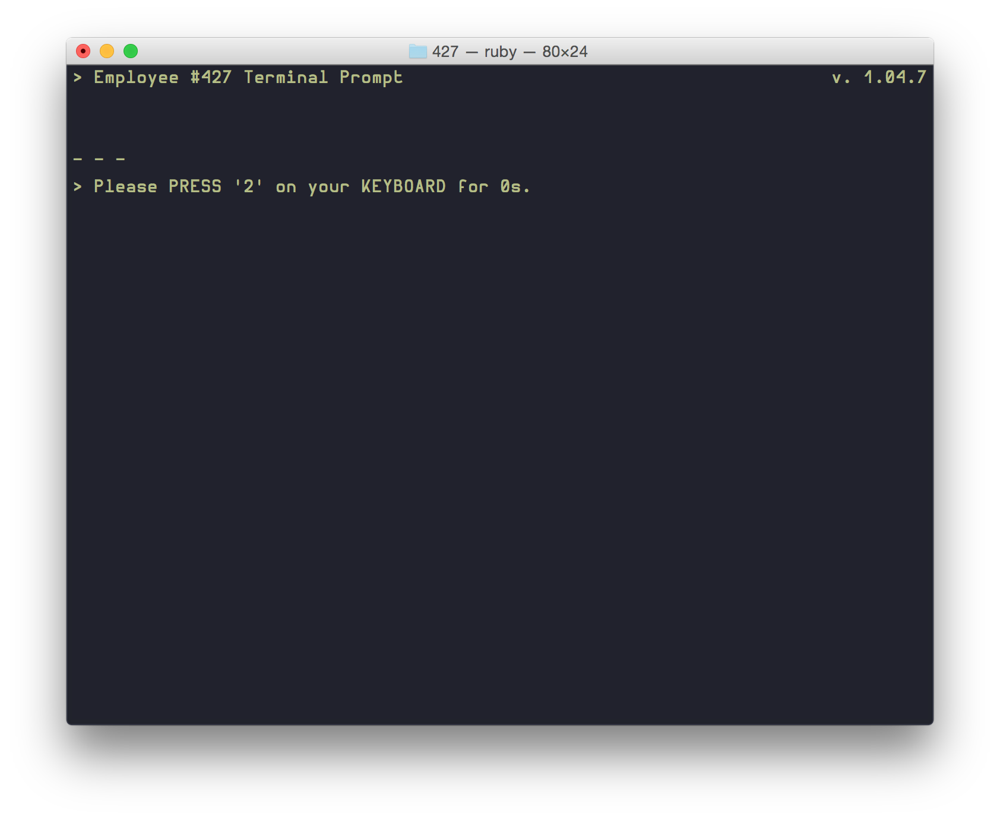

# 427

> Stanley worked for a company in a big building where he was employee 
> number 427. Employee Number 427's job was simple: he sat at his desk in
> room 427, and he pushed buttons on a keyboard. Orders came to him 
> through a monitor on his desk, telling him what buttons to push, how 
> long to push them, and in what order.

Now you get to be the new Employee 427 ;)




## Installation

```bash
gem install 427
```

## Usage

Get to work with:

```
427
```

And follow the commands. Quickly, of course. Slacking off won't be tolerated.

## Todo

- Get the long keypresses to work. Keypresses stack up and get used for future commands, breaking the entire thing.
